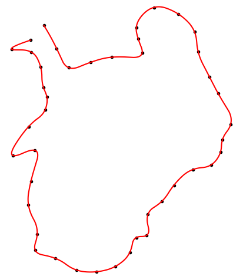

# gpx_interpolate.py

Python script to interpolate GPX files using linear or spline interpolation

Interpolates latitude, longitude and elevation at any spatial resolution

## Usage

### Script
```
usage: gpx_interpolate.py [-h] [-d DEG] [-r RES] FILE [FILE ...]

Interpolate GPX file(s) using linear/spline interpolation

positional arguments:
  FILE               GPX file(s)

optional arguments:
  -h, --help         show this help message and exit
  -d DEG, --deg DEG  Interpolation degree, 1=linear, 2-5=spline (default: 1)
  -r RES, --res RES  Interpolation resolution in meters (default: 1)
```

### Module
```python
from gpx_interpolate import gpx_interpolate

gpx_data = dict{'lat':lat,
                'lon':lon,
                'ele':ele,
                'tstamp':tstamp,
                'tzinfo':tzinfo}

gpx_data = gpx_interpolate(gpx_data, res, deg)
```

where:  
`lat`, `lon` and `ele` (optional) are the trackpoints latitude, longitude and elevation   
`tstamp` (optional) is the trackpoints POSIX time  
`tzinfo` (optional) is the timezone in `datetime.tzinfo` format (`None` for UTC)   
`res` is the interpolation resolution in meters  
`deg` is the interpolation in degree: `1` for linear interpolation (default) or `2-5` for spline interpolation  

`ele`, `tstamp` and `tzinfo` are optional and can be set to `None`

### Example
:black_circle: = original GPX data, :red_circle: = interpolated data  


## Requirements
```
numpy==1.18.1
scipy==1.4.1
gpxpy==1.4.0
```
